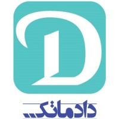

<!-- <h1 align="center">
  
   Dadmatools
</h1> -->


<h2 align="center">DadmaTools: A Python NLP Library for Persian</h2>

<div align="center">
  <a href="https://pypi.org/project/dadmatools/"></a>
  <a href=""></a>
  <a href='https://dadmatools.readthedocs.io/en/latest/'></a>
</div>
<div align="center">
  <h5>
      Named Entity Recognition
    <span> | </span>
      Part of Speech Tagging
    <span> | </span>
      Dependency Parsing
    <span> | </span>
      Informal To Formal
  </h5>
  <h5>
      Constituency Parsing
    <span> | </span>
      Chunking
    <span> | </span>
      Kasreh Ezafe Detection
  </h5>
  <h5>
      Spellchecker
    <span> | </span>
       Normalizer
    <span> | </span>
      Tokenizer
    <span> | </span>
      Lemmatizer
    <span> | </span>
      Sentiment Analysis
  </h5>
  <h5>
  </h5>
</div>


# **DadmaTools**
DadmaTools is a repository for Natural Language Processing resources for the Persian Language. The aim is to make it easier and more applicable to practitioners in the industry to use Persian NLP, and hence this project is licensed to allow commercial use. The project features code examples on how to use the models in popular NLP frameworks such as spaCy and Transformers, as well as Deep Learning frameworks such as PyTorch. Furthermore, DadmaTools support common Persian embedding and Persian datasets.
for more details about how to use this tool read the instruction below.

Contents:
- [Installation](#installation)
- [NLP Models](#nlp-models)
  - [Normalizer](#normalizer)
  - [Pipline (tok,lem,dep,pos,cons,chunk,kasreh,spellchecker)](#pipeline)
- [Datasets](#loading-persian-nlp-datasets)
- [Embeddings](#loading-persian-word-embeddings)
- [Evaluation](#evaluation)
- [How to use in colab](#how-to-use)
- [Cite us](#cite)

## Installation

To get started using DadmaTools, install the project with pip:

- **Full Version**  
  Includes all features, including transformers and trainable modules:  
  ```bash
  pip install dadmatools
  ```

- **Light Version**  
  For users who prefer only datasets and non-trainable modules without transformers:  
  ```bash
  pip install dadmatools[light]
  ```


### Install from github
Alternatively you can install the latest version from github using:
```bash
pip install git+https://github.com/Dadmatech/dadmatools.git
```


## NLP Models

Natural Language Processing is an active area of research, and it consists of many different tasks. 
The DadmaTools repository provides an overview of Persian models for some of the most basic NLP tasks (and is continuously evolving). 

Here is the list of NLP tasks we currently cover in the repository. These NLP tasks are defined as pipelines. Therefore, a pipeline list must be created and passed through the model. This will allow the user to choose the only task needed without loading others. 
Each task has its abbreviation as follows:
-  Named Entity Recognition: ```ner```
-  Part of speech tagging: ```pos```
-  Dependency parsing: ```dep```
-  Constituency parsing: ```cons```
-  Kasreh Ezafe Detection: ```kasreh```
-  Chunking: ```chunk```
-  Lemmatizing: ```lem```
-  Tokenizing: ```tok```
-  Spellchecker: ```spellchecker```
-  Normalizing
-  informal2formal: ```itf```
-  Sentiment analysis: ```sent```

**Note** that the normalizer can be used outside of the pipeline as there are several configs (the default config is in the pipeline with the name of def-norm).
**Note** that if no pipeline is passed to the model, the tokenizer will be loaded as default.

<!--### Use Case -->

<!-- These NLP tasks are defined as pipelines. Therefore, a pipeline list must be created and passed through the model. This will allow the user to choose the only task needed without loading others. 
Each task has its abbreviation as following:
-  ```ner```: Named entity recognition
-  ```pos```: Part of speech tagging
-  ```dep```: Dependency parsing
-  ```cons```: Constituency parsing
-  ```chunk```: Chunking
-  ```kasreh```: Kasreh Ezafe Detection
-  ```spellchecker```: SpellChecker
-  ```lem```: Lemmatizing
-  ```tok```: Tokenizing
-  ```itf```: informal to formal
-  ```sent```: Sentiment analysis

Note that the normalizer can be used outside of the pipeline as there are several configs.
Note that if no pipeline is passed to the model the tokenizer will be load as default. -->

### Normalizer
cleaning text and unify characters.

Note: None means no action! 
```python
from dadmatools.normalizer import Normalizer

normalizer = Normalizer(
    full_cleaning=False,
    unify_chars=True,
    refine_punc_spacing=True,
    remove_extra_space=True,
    remove_puncs=False,
    remove_html=False,
    remove_stop_word=False,
    replace_email_with="<EMAIL>",
    replace_number_with=None,
    replace_url_with="",
    replace_mobile_number_with=None,
    replace_emoji_with=None,
    replace_home_number_with=None
)

text = """
<p>
دادماتولز اولین نسخش سال ۱۴۰۰ منتشر شده. 
امیدواریم که این تولز بتونه کار با متن رو براتون شیرین‌تر و راحت‌تر کنه
لطفا با ایمیل dadmatools@dadmatech.ir با ما در ارتباط باشید
آدرس گیت‌هاب هم که خب معرف حضور مبارک هست:
 https://github.com/Dadmatech/DadmaTools
</p>
"""
normalized_text = normalizer.normalize(text)
# <p> دادماتولز اولین نسخش سال 1400 منتشر شده. امیدواریم که این تولز بتونه کار با متن رو براتون شیرین‌تر و راحت‌تر کنه لطفا با ایمیل <EMAIL> با ما در ارتباط باشید آدرس گیت‌هاب هم که خب معرف حضور مبارک هست: </p>

# full cleaning
normalizer = Normalizer(full_cleaning=True)
normalized_text = normalizer.normalize(text)
# دادماتولز نسخش سال منتشر تولز بتونه کار متن براتون شیرین‌تر راحت‌تر کنه ایمیل ارتباط آدرس گیت‌هاب معرف حضور مبارک

```

### Pipeline
Containing Tokenizer, Lemmatizer, POS Tagger, Dependancy Parser, Constituency Parser, Kasreh, Spellcheker, Infromal To Formal, Name Entity Recognation.

```python
import dadmatools.pipeline.language as language

# here lemmatizer and pos tagger will be loaded
# as tokenizer is the default tool, it will be loaded as well even without calling
pips = 'tok,lem,pos,dep,chunk,cons,spellchecker,kasreh,itf,ner,sent'
nlp = language.Pipeline(pips)
# doc is an SpaCy object
doc = nlp('کشور بزرگ ایران توانسته در طی سال‌ها اغشار مختلفی از قومیت‌های گوناگون رو به خوبی تو خودش  جا بده')

```
[```doc```](https://spacy.io/api/doc) object has different extensions. First, there are ```sentences``` in ```doc``` which is the list of the list of [```Token```](https://spacy.io/api/token). Each [```Token```](https://spacy.io/api/token) also has its own extensions. Note that we defined our own extension as well in DadmaTools. If any pipeline related to the specific extensions is not called, that extension will have no value.

To better see the results which you can use this code:

```python
print(doc)
```

```python
{'spellchecker': {'orginal': 'کشور بزرگ ایران توانسته در طی سال\u200cها اغشار مختلفی از قومیت\u200cهای گوناگون رو به خوبی تو خودش  جا بده', 'corrected': 'کشور بزرگ ایران توانسته در طی سال\u200cها اقشار مختلفی از قومیت\u200cهای گوناگون رو به خوبی تو خودش جا بده', 'checked_words': [('اغشار', 'اقشار')]}, 'itf': ' کشور بزرگ ایران توانسته در طی سال\u200cها اغشار مختلفی از قومیت های گوناگون را به خوبی در خودش جا بده', 'sentences': [{'id': 1, 'tokens': [{'id': 1, 'text': 'کشور', 'upos': 'NOUN', 'xpos': 'N_PL', 'feats': 'Number=Plur|Person=2|Polarity=Neg|Tense=Pres', 'head': 14, 'deprel': 'nsubj', 'lemma': 'کشور', 'ner': 'O', 'kasreh': 'S-kasreh'}, {'id': 2, 'text': 'بزرگ', 'upos': 'ADJ', 'xpos': 'ADJ', 'feats': 'Degree=Pos', 'head': 8, 'deprel': 'amod', 'lemma': 'بزرگ', 'ner': 'O', 'kasreh': 'S-kasreh'}, {'id': 3, 'text': 'ایران', 'upos': 'SCONJ', 'xpos': 'CON', 'feats': 'Number=Plur|Person=3|PronType=Prs', 'head': 2, 'deprel': 'nmod:poss', 'lemma': 'ایران', 'ner': 'S-loc', 'kasreh': 'O'}, {'id': 4, 'text': 'توانسته', 'upos': 'VERB', 'xpos': 'V_PP', 'feats': 'Number=Sing|Person=3|VerbForm=Part', 'head': 14, 'deprel': 'aux', 'lemma': 'توانست#توان', 'ner': 'O', 'kasreh': 'O'}, {'id': 5, 'text': 'در', 'upos': 'ADP', 'xpos': 'P', 'head': 14, 'deprel': 'case', 'lemma': 'در', 'ner': 'O', 'kasreh': 'O'}, {'id': 6, 'text': 'طی', 'upos': 'ADP', 'xpos': 'P', 'head': 5, 'deprel': 'fixed', 'lemma': 'طی', 'ner': 'O', 'kasreh': 'S-kasreh'}, {'id': 7, 'text': 'سال\u200cها', 'upos': 'AUX', 'xpos': 'V_PRS', 'feats': 'Number=Sing|Person=3|Tense=Pres', 'head': 14, 'deprel': 'fixed', 'lemma': 'سال', 'ner': 'O', 'kasreh': 'O'}, {'id': 8, 'text': 'اغشار', 'upos': 'NOUN', 'xpos': 'N_PL', 'feats': 'Number=Plur', 'head': 19, 'deprel': 'nsubj', 'lemma': 'اغشار', 'ner': 'O', 'kasreh': 'S-kasreh'}, {'id': 9, 'text': 'مختلفی', 'upos': 'ADJ', 'xpos': 'ADJ', 'feats': 'Degree=Pos', 'head': 8, 'deprel': 'amod', 'lemma': 'مختلفی', 'ner': 'O', 'kasreh': 'O'}, {'id': 10, 'text': 'از', 'upos': 'ADP', 'xpos': 'P', 'head': 15, 'deprel': 'case', 'lemma': 'از', 'ner': 'O', 'kasreh': 'O'}, {'id': 11, 'text': 'قومیت\u200cهای', 'upos': 'NOUN', 'xpos': 'N_PL', 'feats': 'Number=Plur', 'head': 8, 'deprel': 'nmod:poss', 'lemma': 'قومیت', 'ner': 'O', 'kasreh': 'S-kasreh'}, {'id': 12, 'text': 'گوناگون', 'upos': 'ADJ', 'xpos': 'ADJ', 'feats': 'Degree=Pos', 'head': 11, 'deprel': 'amod', 'lemma': 'گوناگون', 'ner': 'O', 'kasreh': 'O'}, {'id': 13, 'text': 'رو', 'upos': 'PART', 'xpos': 'CLITIC', 'head': 8, 'deprel': 'case', 'lemma': 'رو', 'ner': 'O', 'kasreh': 'O'}, {'id': 14, 'text': 'به', 'upos': 'ADP', 'xpos': 'P', 'head': 19, 'deprel': 'case', 'lemma': 'به', 'ner': 'O', 'kasreh': 'O'}, {'id': 15, 'text': 'خوبی', 'upos': 'ADJ', 'xpos': 'ADJ', 'feats': 'Degree=Pos', 'head': 14, 'deprel': 'advcl', 'lemma': 'خوب', 'ner': 'O', 'kasreh': 'O'}, {'id': 16, 'text': 'تو', 'upos': 'ADP', 'xpos': 'P', 'feats': 'Number=Sing|Person=2|PronType=Prs', 'head': 19, 'deprel': 'case', 'lemma': 'تو', 'ner': 'O', 'kasreh': 'O'}, {'id': 17, 'text': 'خودش', 'upos': 'PRON', 'xpos': 'PRO', 'feats': 'Number=Sing|Person=3|PronType=Prs|Reflex=Yes', 'head': 19, 'deprel': 'obl', 'lemma': 'خودش', 'ner': 'O', 'kasreh': 'O'}, {'id': 18, 'text': 'جا', 'upos': 'VERB', 'xpos': 'PREV', 'feats': 'Number=Sing|Person=3|Tense=Pres', 'head': 19, 'deprel': 'compound:lvc', 'lemma': 'جا', 'ner': 'O', 'kasreh': 'O'}, {'id': 19, 'text': 'بده', 'upos': 'VERB', 'xpos': 'V_SUB', 'feats': 'Mood=Sub', 'head': 0, 'deprel': 'root', 'lemma': 'داد#ده', 'ner': 'O', 'kasreh': 'O'}]}], 'lang': 'persian', 'sentiment': [{'label': 'positive', 'score': 0.7366364598274231}]}
```


## Loading Persian NLP Datasets
We provide an easy-to-use way to load some popular Persian NLP datasets

Here is the list of supported datasets.

   |    Dataset             | Task 
|       :----------------:               |  :----------------:   
   |    PersianNER           |   Named Entity Recognition   | 
   |       ARMAN             |   Named Entity Recognition
   |       Peyma             | Named Entity Recognition
  |       FarsTail           | Textual Entailment
 |        FaSpell           | Spell Checking
  |      PersianNews        | Text Classification
  |       PerUDT            | Universal Dependency
  |      PnSummary          | Text Summarization
  |    SnappfoodSentiment   | Sentiment Classification
  |           TEP           | Text Translation(eng-fa)
| WikipediaCorpus               | Corpus
| PersianTweets           | Corpus


all datasets are iterator and can be used like below:
```python
from dadmatools.datasets import FarsTail
from dadmatools.datasets import SnappfoodSentiment
from dadmatools.datasets import Peyma
from dadmatools.datasets import PerUDT
from dadmatools.datasets import PersianTweets
from dadmatools.datasets import PnSummary


farstail = FarsTail()
#len of dataset
print(len(farstail.train))

#like a generator
print(next(farstail.train))

#dataset details
pn_summary = PnSummary()
print('PnSummary dataset information: ', pn_summary.info)

#loop over dataset
snpfood_sa = SnappfoodSentiment()
for i, item in enumerate(snpfood_sa.test):
    print(item['comment'], item['label'])

#get first tokens' lemma of all dev items
perudt = PerUDT()
for token_list in perudt.dev:
    print(token_list[0]['lemma'])

#get NER tag of first Peyma's data
peyma = Peyma()
print(next(peyma.data)[0]['tag'])

#corpus 
tweets = PersianTweets()
print('tweets count : ', len(tweets.data))
print('sample tweet: ', next(tweets.data))
```
get dataset info:
```python

from dadmatools.datasets import get_all_datasets_info

get_all_datasets_info().keys()
#dict_keys(['Persian-NEWS', 'fa-wiki', 'faspell', 'PnSummary', 'TEP', 'PerUDT', 'FarsTail', 'Peyma', 'snappfoodSentiment', 'Persian-NER', 'Arman', 'PerSent'])

#specify task
get_all_datasets_info(tasks=['NER', 'Sentiment-Analysis'])
```
the output will be:

```json
{"ARMAN": {"description": "ARMAN dataset holds 7,682 sentences with 250,015 sentences tagged over six different classes.\n\nOrganization\nLocation\nFacility\nEvent\nProduct\nPerson",
  "filenames": ["train_fold1.txt",
   "train_fold2.txt",
   "train_fold3.txt",
   "test_fold1.txt",
   "test_fold2.txt",
   "test_fold3.txt"],
  "name": "ARMAN",
  "size": {"test": 7680, "train": 15361},
  "splits": ["train", "test"],
  "task": "NER",
  "version": "1.0.0"},
 "PersianNer": {"description": "source: https://github.com/Text-Mining/Persian-NER",
  "filenames": ["Persian-NER-part1.txt",
   "Persian-NER-part2.txt",
   "Persian-NER-part3.txt",
   "Persian-NER-part4.txt",
   "Persian-NER-part5.txt"],
  "name": "PersianNer",
  "size": 976599,
  "splits": [],
  "task": "NER",
  "version": "1.0.0"},
 "Peyma": {"description": "source: http://nsurl.org/2019-2/tasks/task-7-named-entity-recognition-ner-for-farsi/",
  "filenames": ["peyma/600K", "peyma/300K"],
  "name": "Peyma",
  "size": 10016,
  "splits": [],
  "task": "NER",
  "version": "1.0.0"},
 "snappfoodSentiment": {"description": "source: https://huggingface.co/HooshvareLab/bert-fa-base-uncased-sentiment-snappfood",
  "filenames": ["snappfood/train.csv",
   "snappfood/test.csv",
   "snappfood/dev.csv"],
  "name": "snappfoodSentiment",
  "size": {"dev": 6274, "test": 6972, "train": 56516},
  "splits": ["train", "test", "dev"],
  "task": "Sentiment-Analysis",
  "version": "1.0.0"}}
```


## Loading Persian Word Embeddings
To start using embedding please install fasttext:

`pip install fasttext`

download, load and use some pre-trained Persian word embeddings.

dadmatools supports all glove, fasttext, and word2vec formats.
```python
from dadmatools.embeddings import get_embedding, get_all_embeddings_info, get_embedding_info
from pprint import pprint

pprint(get_all_embeddings_info())

#get embedding information of specific embedding
embedding_info = get_embedding_info('glove-wiki')

#### load embedding ####
word_embedding = get_embedding('glove-wiki')

#get vector of the word
print(word_embedding['سلام'])

#vocab
vocab = word_embedding.get_vocab()

### some useful functions ###
print(word_embedding.top_nearest("زمستان", 10))
print(word_embedding.similarity('کتب', 'کتاب'))
print(word_embedding.embedding_text('امروز هوای خوبی بود'))
```
The following word embeddings are currently supported: 

| Name | Embedding Algorithm | Corpus | 
| :-------------: | :-------------:  | :-------------:  | 
| [`glove-wiki`](https://github.com/Text-Mining/Persian-Wikipedia-Corpus/tree/master/models/glove)  | glove | Wikipedia  |
| [`fasttext-commoncrawl-bin`](https://fasttext.cc/docs/en/crawl-vectors.html) | fasttext | CommonCrawl |
| [`fasttext-commoncrawl-vec`](https://fasttext.cc/docs/en/crawl-vectors.html) | fasttext | CommonCrawl |
| [`word2vec-conll`](http://vectors.nlpl.eu/) | word2vec | Persian CoNLL17 corpus  |

## Evaluation
We have compared our pos tagging, dependancy parsing, and lemmatization models to `stanza` and `hazm`.

<table>
  <tr align='center'>
    <td colspan="4"><b>PerDT (F1 score)</b></td>
  </tr>
  <tr align='center'>
    <td><b>Toolkit</b></td>
    <td><b>POS Tagger (UPOS)</b></td>
    <td><b>Dependancy Parser (UAS/LAS)</b></td>
    <td><b>Lemmatizer</b></td>
  </tr>
  <tr align='center'>
    <td>DadmaTools</td>
    <td><b>97.52%</b></td>
    <td><b>95.36%</b>  /  <b>92.54%</b> </td>
    <td><b>99.14%</b> </td>
  </tr>
  <tr align='center'>
    <td>stanza</td>
    <td>97.35%</td>
    <td>93.34%  /  91.05% </td>
    <td>98.97% </td>
  </tr>
  <tr align='center'>
    <td>hazm</td>
    <td>-</td>
    <td>- </td>
    <td>89.01% </td>
  </tr>


  <tr align='center'>
    <td colspan="4"><b>Seraji (F1 score)</b></td>
  </tr>
  <tr align='center'>
    <td><b>Toolkit</b></td>
    <td><b>POS Tagger (UPOS)</b></td>
    <td><b>Dependancy Parser (UAS/LAS)</b></td>
    <td><b>Lemmatizer</b></td>
  </tr>
  <tr align='center'>
    <td>DadmaTools</td>
    <td><b>97.83%</b></td>
    <td><b>92.5%</b>  /  <b>89.23%</b> </td>
    <td> - </td>
  </tr>
  <tr align='center'>
    <td>stanza</td>
    <td>97.43%</td>
    <td>87.20% /  83.89% </td>
    <td> - </td>
  </tr>
  <tr align='center'>
    <td>hazm</td>
    <td>-</td>
    <td>- </td>
    <td>86.93% </td>
  </tr>
</table>


<table>
  <tr align='center'>
    <td colspan="2"><b>Tehran university tree bank (F1 score)</b></td>
  </tr>
  <tr align='center'>
    <td><b>Toolkit</b></td>
    <td><b>Constituency Parser</b></td>
  </tr>
  <tr align='center'>
    <td>DadmaTools (without preprocess))</td>
    <td><b>82.88%</b></td>
  </tr>
  <tr align='center'>
    <td>Stanford (with some preprocess on POS tags)</td>
    <td>80.28</td>
  </tr>
</table>


## How to use
You can see the codes and the output in colab.

[](https://colab.research.google.com/drive/1BEhOA9Ju0ZyY81MAM_IT9ADz1MFeXF7S?usp=sharing)


## Cite
```
@inproceedings{jafari2025dadmatools,
  title={DadmaTools V2: an Adapter-Based Natural Language Processing Toolkit for the Persian Language},
  author={Jafari, Sadegh and Farsi, Farhan and Ebrahimi, Navid and Sajadi, Mohamad Bagher and Eetemadi, Sauleh},
  booktitle={Proceedings of the 1st Workshop on NLP for Languages Using Arabic Script},
  pages={37--43},
  year={2025}
}
``` 

<!-- Read the paper here.  -->
